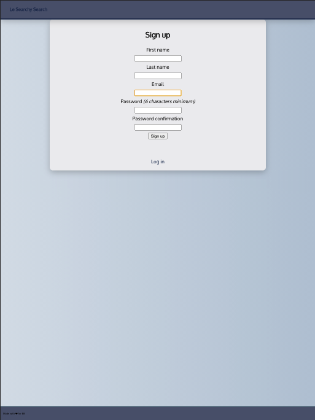

# Searchy-Search

[SEARCHY-SEARCH](https://searchysearch.herokuapp.com/) is a Ruby on Rails web app designed to help organize information and make it accessible to sales people. Users can sign up to access the database, search pdf's, customer-facing sales materials and email templates as needed.

## Usage 👩‍💻

In order to get started with this web app, you'll need to clone the repo. After cloning, complete the following steps:

- Bundle install the necessary gems
- Assure postgresql is installed on your local device
- Use the command createdb searchy_search_development.

Your terminal should look like this:

```bash
git clone https://github.com/mikezalik/searchy-search.git
cd searchy-search
bundle install
createdb searchy_search_development
rake db:migrate
```

- **Development**: to run the app locally you will need 1 terminal window/tab and a local postgresql instance (I recommend postgres.app to track local dev instances). Start the server with the command listed below:

```bash
rails s
```

Once started, open your browser to `localhost:3000`

- **Build/Production**: This web app is hosted on heroku and may be accessed at (https://searchysearch.herokuapp.com/). Follow the command-line steps below to deploy your own instance on heroku.

```bash
heroku login
heroku create
git config --list --local | grep heroku
git push heroku main
heroku run rake db:migrate
heroku ps:scale web=1
heroku open
```

## Project Summary

Searchy-search is a monolith designed to help keep important sales information close and readily accessible. Searchy Search's primary objective is to keep this information indexable and easy to search for access while on sales calls or while typing up follow up emails for prospective clients. Searchy Search's second objective is to help maintain consistency within sales departments to help each account executive find relevant sales battle cards.

## Screenshots 📸

|  |  |  |  |
| :--------------------------------------------------------------------: | :----------------------------------------------------------------------------------: | :-----------------------------------------------------------------------: | :-------------------------------------------------------------------------------: |
|                                 Login                                  |                                     Registration                                     |                                 Home Page                                 |                                    Search Item                                    |

## Design Process 📐

In the design phase of this application, I started by thinking about user stories to help determine key features. The primary user journey involves searching and accessing items and I wireframed the UI to make this a priority. I decided to streamline authentication and use Rail's Devise gem to help make this a reality. I love React but reasoned that there wouldn't be enough dynamic content to warrant implementing it. I decided to use the ERB templating engine for the interface as most content would be provided as attachments.

## Development Process 🛠

In the development phase of this application, I began with an MVC and RESTful build out in Rails. Though I prefer to work html first as it promotes progressive enhancement, I was concerned with the backend logic at first and the conventions in Rails both promote and allow for this approach to be used. With this foundation and a functional MVP, it was easy to choose which features would benefit from enhancement and which tools within Rails would be best suited for the job.

Styling is written in Sass and transpiled to CSS3.

## Tech Used 💻

### Front-End

- HTML5
- CSS3
- [Sass](http://sass-lang.com/)
- [ERB](https://ruby-doc.org/stdlib-2.7.2/libdoc/erb/rdoc/ERB.html)

### Back-End

- [Ruby on Rails](https://rubyonrails.org/)
- [Devise](https://github.com/heartcombo/devise)
- [Postgresql](https://www.postgresql.org/)

### Testing and Deployment

- [RuboCop](https://rubocop.org/) - ruby linter
- [ESLint](http://eslint.org/) - linting utility
- [Heroku](https://www.heroku.com/) - cloud PaaS
