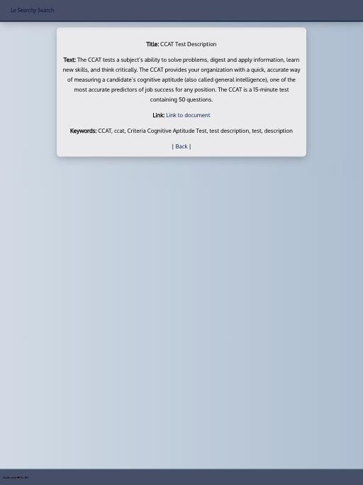

# Searchy Search

[SEARCHY-SEARCH](https://searchysearch.herokuapp.com/) is a Ruby on Rails web application designed to help organize information and make it accessible for sales people on demand. Users can sign up and search pdf's, sales language and email templates as needed.

## Usage 👩‍💻

In order to get started clone this repo. Bundle install the necessary gems, assure postgresql is installed on your local device and createdb searchy-search-development. Your terminal should look like this:

```bash
git clone https://github.com/mikezalik/searchy-search.git
cd searchy-search
bundle install
createdb searchy_search_development
rake db:migrate
```

- **Development**: to run the app locally you will need 1 terminal window/tab and a local postgresql instance (I prefer to use postgres.app to track my local dev instances). Open your browser to `localhost:3000` after you start the server with the command below.

```bash
rails s
```

- **Build/Production**: The app is hosted on heroku and can be accessed at (https://searchysearch.herokuapp.com/). Follow the steps below to deploy to heroku.

```bash
heroku login
heroku create
git config --list --local | grep heroku
git push heroku main
heroku run rake db:migrate
heroku ps:scale web=1
heroku open
```

## Project Summary

SEARCHY-SEARCH is designed to help keep important information close and retrievable. The primary focus is to keep this information indexable and easy to search for access while on sales calls or while typing up follow up emails for prospective clients. The secondary focus is to help maintain consistency within sales departments to help each sales executive find relevant and effective sales language.

## Screenshots 📸

|  |
| :--------------------------: |
|         Landing Page         |

|  |  |  |  |
| :--------------------------------------------------------------------: | :----------------------------------------------------: | :-----------------------------------------------------------------------: | :-------------------------------------------------------------------------------: |
|                                 Login                                  |                      Registration                      |                                 Home Page                                 |                                    Search Item                                    |

## Design Process 📐

In the design phase of this application, I started thinking about user stories to determine key features. The primary user features are searching items and accessing these items. I decided to streamline authentication and use Devise to help with this. I approached this application from the standpoint of ease of use. I love React but reasoned that this same simplicity didn't warrant coupling React to a Rails backend and decided to use the ERB templating engine to provide the interface. The intent of the app was to make sure that accessing pertinent information was as straightforward as possible. This reinforces my primary goal of providing an experience which is as simple and intuitive as possible.

## Development Process 🛠

In the development phase of this application, I began with MVC build out in Rails. Though I prefer to work html first as it promotes progressive enhancement, I was concerned with the backend logic initially and the conventions in Rails allow for this approach to be used. With a base, built in HTML, it was easy to choose which aspects would benefit from enhancement and which tools would be best suited for their creation. In order to maintain the goals set in my design process (with accessibility in mind), I used ERB templates. Because I wouldn't need to reason with a lot of state I thought this would be sufficient to help maintain simplicity and a straightforward implementation.

On the back-end, I built a RESTful architecture with the end user retaining access to GET operations. To solve the issue of authentication, Devise was implemented, complete with its own models and views.

Styling is written in Sass and transpiled to CSS3.

## Tech Used 💻

### Front-End

- HTML5
- CSS3
- [Sass](http://sass-lang.com/)
- [ERB](https://ruby-doc.org/stdlib-2.7.2/libdoc/erb/rdoc/ERB.html)

### Back-End

- [Ruby on Rails](https://rubyonrails.org/)
- [Devise](https://github.com/heartcombo/devise)
- [Postgresql](https://www.postgresql.org/)

### Testing and Deployment

- [Heroku](https://www.heroku.com/) - cloud PaaS
- [ESLint](http://eslint.org/) - linting utility
